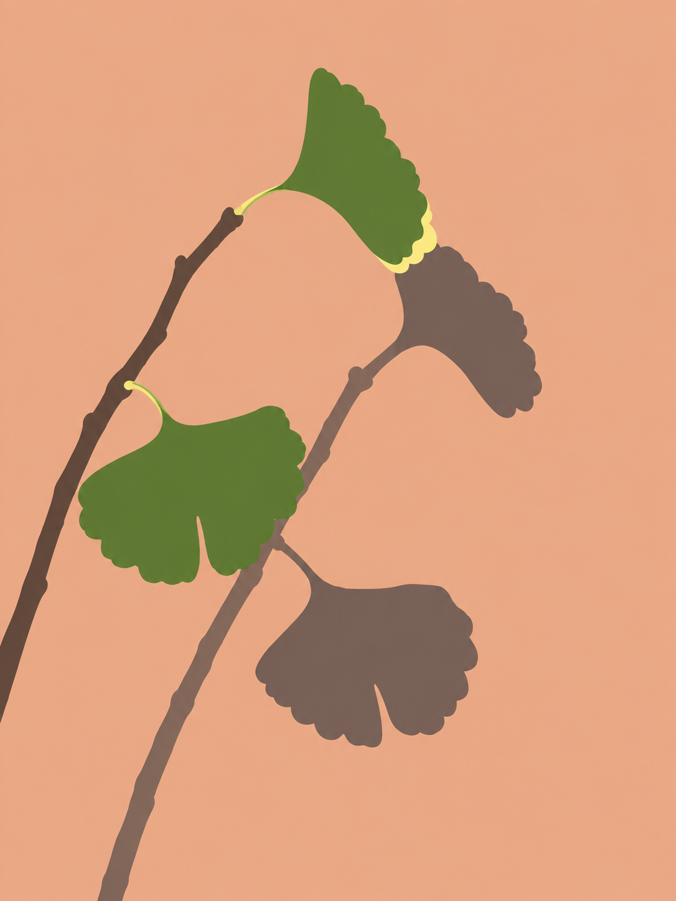
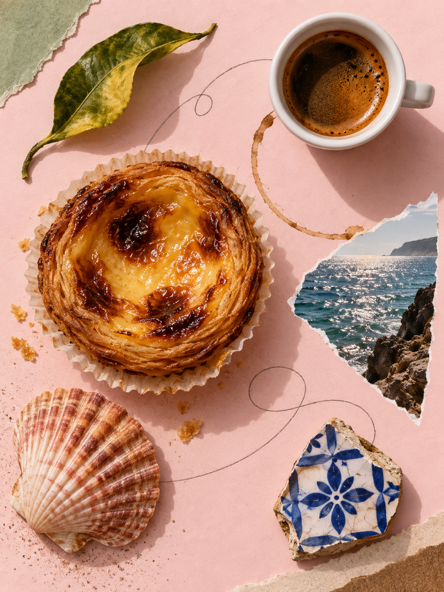

# Photo Alchemy Studio

[打开在线风格目录](https://reneexiaoxiao.github.io/photo-alchemy-studio/) · [查看 Renee 工作流](styles/) · [来源与许可](THIRD_PARTY.md)

把旅行照片变成想收藏、想分享的作品：既可以抽象成形状与光影，也可以重组成一段游记，或转译成马赛克、刺绣与纸雕。

本库工作流扩展到 **46 个**：18 个由 Renee 编写（15 个原创实现、3 个参考用户截图的独立再设计）+ 28 个社区来源。其中 **9 个社区模块**随公开库附带，其余保留来源；目录显示、样图和验证进度以图鉴各条目的实际状态为准。2026-09-14 按免费个人非商业图鉴的用途恢复7张已获许可图片，并用4张 Renee 新生成样例补齐其余条目。社区风格与样例制作者分别署名；本地完整收藏仍保留原参考图。详见 [本次图片与许可更新](docs/public-previews-2026-09-14.md)。

一个照片二创 Skill 入口，配套可离线浏览的风格目录和本地 GitHub 扩充工具。沿用 Photo Alchemy 集合的纸感、荧光绿与淡紫视觉语言；保留社区作者的原始方法与许可。界面无需构建，无需额外 npm 依赖。

<p>



</p>

原创方法先提取输入的主体、形态、光影和关系，再决定颜色与构图。图鉴不限定国家或演示对象；支持按照片题材、保留方式和视觉方向筛选。五形提炼与光影提炼各有食物、植物、建筑三类输入对照，均使用合成测试照片。社区原图继续保留作者与许可。

2026-09-15 新增七种工作流：中式留白拼贴、邮票时刻、剪纸叙事、冰箱贴、悬衡小剧场、折景明信片、画面谜语，可点图鉴「新收录」查看。七项均有原图对照，冰箱贴有三类输入试作；底图来源、署名与限制见 [本次试作记录](docs/playful-examples.md)。

2026-09-14 收录的十种社区风格也继续保留：照片奇遇、蜡笔小记、珐琅拾光、旅途章印、颜料小岛、蓝晒时光、像素切片拉伸、虹彩柔焦长曝光、照片图形乐谱、针织隐喻。详见 [收录与边界](docs/github-expansion-2026-09-14.md)。

## 开始使用

1. 下载仓库并打开 `index.html`，看样张、按来源筛选、比较底图和结果，复制风格指令。
2. 将整个仓库放入 Codex 的一个 Skill 目录，根目录 `SKILL.md` 是唯一入口。已有 `photo-alchemy` 时先备份并合并；不要直接覆盖旧库或把受限来源加入公开仓库。
3. 在支持图片编辑的 Codex 会话里附上自己的照片，粘贴指令即可。默认走可用的内置 ImageGen，网页本身不生成图片。

```text
用 $photo-alchemy 的 mosaic-tiles 处理这张旅行照，保留主要空间关系和标志性细节，生成一张马赛克瓷砖作品。
```

## Renee 编写的工作流

风格名称更通用，原有 Skill ID 保持兼容。下表是15个原创实现；另3个参考截图的独立再设计在后表单独署名。

| 风格 | 固定方法 | 随输入改变 |
|---|---|---|
| `souvenir-constellation` 碎片星图 | 一个主片段与少量次片段不等尺度 | 单图可用全貌与真实细节，多图按视觉呼应筛选，片段数量与留白不按照片张数平均。 |
| `city-five-shapes` 五形提炼 | 约五个主形通过共边和负形咬合 | 主轴、负形、分形与颜色随输入变化，密集场景先合并背景，单主体保住完整轮廓。 |
| `landscape-strata` 轮廓层谱 | 独特总轮廓保持来源识别 | 层带沿源图水平、纵向、放射或闭合结构变化，近远与遮挡次序始终可追溯。 |
| `walking-multiview` 多视角接景 | 主视图与次视图尺度分明 | 沿输入水平线、斜线或曲线接景，单图用真实局部跨尺度连接，不生成未见视角。 |
| `courtyard-shadow-atlas` 光影提炼 | 选真实投影、透光或反射为主关系 | 按真实光学关系选择分支，可放大光影并缩小证据，拓扑保留而像素位置可重组。 |
| `miniature-journey` 多视点微缩 | 连续平面里有主次与安静停顿 | 按可见节点组织观看而非地理路线，单图可展开全貌与细节，不能新增隐藏视角。 |
| `mosaic-tiles` 马赛克瓷砖 | 砖片沿真实轮廓与走势铺排 | 砖形、铺排方向和尺度随曲率、主体密度及源图空隙变化，颜色从输入归并。 |
| `embroidered-patch` 刺绣纪念章 | 一个主轮廓与少量支撑关系 | 章形沿源图长轴或外形变化，针法按几何边缘、有机面与细线分工。 |
| `riso-travel-print` 套色版画 | 先归并主形，再分配有限专色 | 色版数量、明暗分工与留白随源图结构变化，不固定暖冷配方或竖幅。 |
| `paper-cut-theatre` 纸雕层景 | 纸层由真实遮挡顺序提取 | 根据可见前后关系选择层数和间距，单物只采用真实重叠，不补造内部。 |
| `stained-glass-light` 透光彩玻璃 | 接合线沿主要结构形成连贯网络 | 分线跟随几何或有机结构，玻璃色来自源图，细密程度由识别需要决定。 |
| `fridge-magnet` 把这一刻贴起来 | 源图轮廓成为一枚完整浅浮雕磁贴 | 根据形态选材质、外形与凹凸关系，保留数量和识别缺口，不添加纪念品图标。 |
| `kinetic-mobile` 悬衡小剧场 | 源形组成有可信受力关系的不对称悬挂组 | 从实际主轴决定悬臂与分组，源图色彩和关联保留，连接结构服务平衡。 |
| `photo-foldout` 折景明信片 | 同一张连续折页上的真实边缘跨折缝延续 | 折面方向随可见边缘和横竖走势变化，只设一次空间错位，不补隐藏视角。 |
| `visual-rebus` 画面谜语 | 少量可辨线索与一个空间动词构成无字谜面 | 按输入里的承托、包围、穿行等关系选择尺度、位置和遮挡，不靠文字解释。 |

以下3个方向由 **Renee 独立编写，参考用户提供的视觉截图**。尚未找到可核对的截图作者原版 Skill 源码，不能称作作者原版，也不把这些视觉方向宣称为全新发明。

| 风格 | 固定方法 | 随输入改变 |
|---|---|---|
| `heritage-cutout` 中式留白拼贴 | 摄影轮廓跨接源色矩形，以纸白形成疏密 | 主体方向、留白和强调色由照片决定；只在用户提供时使用标题，不补中式装饰。 |
| `postage-keepsake` 邮票时刻 | 单枚齿孔摄影邮票承载一次关系，可有一个真实轮廓越界 | 票面长宽、裁切与边纸取自输入，越界不补肢体或新景物，不编面值、邮戳和日期。 |
| `paper-scene-memory` 剪纸叙事 | 一个主体簇以平面薄纸大形表达动作与关系 | 构图追随真实姿态、承托和遮挡，背景只留少量源图结构，不做深景舞台。 |


以上新增文字署名 **Renee**，采用 AI 辅助编写。“原创实现”指本项目的工作流设计与文字，不代表发明传统艺术媒介。参考截图再设计保留其单独说明；本项目 MIT 不授权参考截图及第三方素材。保持有效的社区方法及调用约定。通用规则见 [风格提炼与迁移](docs/style-grammar.md)，实际试作及局限见 [跨题材对照记录](docs/transfer-review.md)。

推荐时先检查必要结构和保留要求，再优先选择不同视觉方法。没有光影线索时不会硬套光影提炼；要求保留人物身份或照片原貌时会排除原创重绘方法。输入特征由看图后提供，选择器本身不做图像识别，也不输出未经验证的美观分。

## 一套页面，本地完整、公开有界

页面和基础目录只维护一套。公开 `index.html` 加载已审核的条目与图片，新增条目的图示和验证状态逐项显示；本地服务叠加 `.local/` 私人收藏，保留社区原参考图。部分公开样例与本地原参考图不同。运行入口时还会生成 **local.html**，可直接双击离线浏览全部本地图片。新安装后会刷新个人离线版；无需手工维护两个站点。公开仓库不包含个人导出页、私人预览或本地安装记录。

## 添加社区 Skill

安装 Python 3.9+ 和 [GitHub CLI](https://cli.github.com/)，先完成 `gh auth login`。然后在仓库目录运行：

```sh
python3 scripts/launch_studio.py
```

macOS 双击 `打开照片风格库.command` 即可后台启动并打开浏览器；关闭终端不影响图库。再次打开会复用该图库的服务，端口被占用时尝试邻近端口，不关闭其他程序。也可把此命令的 Finder 替身放到桌面。打开后：

1. 粘贴 Skill 名称或 GitHub 仓库首页链接。
2. 选择候选来源，查看许可证、固定版本和具体 Skill。
3. 点击“安装并加入风格库”，完成后立即出现在目录。
4. 用“检查已安装风格更新”发现新版；查看来源后再升级，旧版保留在本地历史目录。

本地入口只在你的电脑监听，不需要把 GitHub 凭据写入网页。不自动执行下载的脚本。当前自动安装面向许可明确且自包含的 Skill；多服务依赖、来源冲突、未授权素材等情况会给出具体原因，可复制请求交给 Codex 继续核实。静态网页能浏览和复制请求，不能独立操作你的文件系统。

完整接口与限制见 [本地服务](docs/local-service.md)，日后增补、同步、回滚见 [维护说明](docs/maintenance.md)。

## 开源许可

新写的代码、18 个 Renee 编写工作流的新增文字和项目文档，在本项目可授权范围内采用 [MIT](LICENSE)。其中3个参考截图的独立再设计不包含对截图、原作者方法或第三方素材的重新授权。社区内容按对应目录中的原始许可证使用，根目录 MIT 不会覆盖第三方权利。作者、固定版本、许可和公开打包边界见 [THIRD_PARTY.md](THIRD_PARTY.md)。

源 Skill 的原文打包与图片展示分别核对：未打包的来源继续保留链接；许可允许的非商业图片可在 Renee 免费个人非商业图鉴展示，并保留对应许可、署名和改编说明。Zeejay、Photo Abstract、Image as Score 及两张 Wibi 新样例不因放入本仓库而改用根 MIT；使用这些图片须遵守各自条款，不能把整库视为可任意商用的 MIT 素材包。完整图片许可见 [图片许可索引](assets/community-previews/LICENSES.md)。`assets/examples/` 与 `assets/transfer/` 是本项目生成的示例；可在本项目所能授权的权利范围内按 MIT 复用，不承诺生成内容在所有司法辖区均存在排他著作权。

## 验证

```sh
python3 -m unittest discover -s tests -v
python3 scripts/build_catalog.py --check
```

单元测试覆盖固定版本、许可、路径约束、安装读回、恢复历史、本机 HTTP 边界、兼容性筛选与后台启动/重复打开。早期画面验收含两种方法 × 三类合成输入照片，本次另有七种方法、九张加工示例；仍有局部渐层等未完全满足语法的情况，具体见跨题材对照记录。其余方法是否完成试作以对应条目与记录为准；新增7个工作流文件本身不构成跨题材验证证据，真实肖像、复杂群像与真实用户旅行照的适配也不能由示例代证。当前内置生图接口未暴露可核验的型号选择，未声称这些样张已通过某个指定 Image 模型版本验收。
