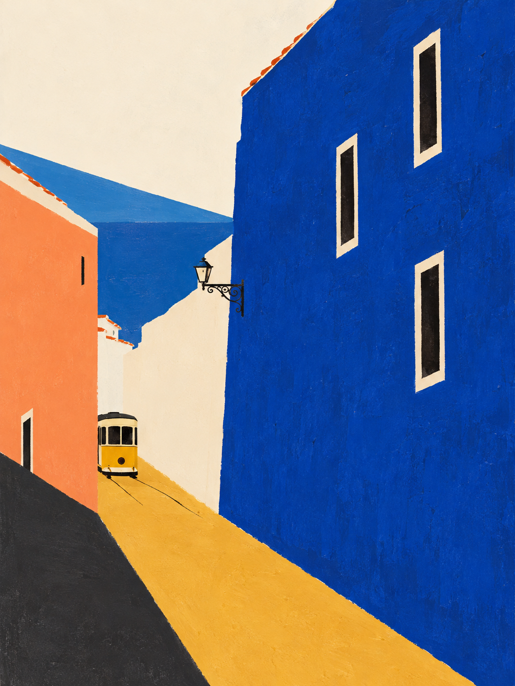

# Photo Alchemy Studio

[打开在线风格目录](https://reneexiaoxiao.github.io/photo-alchemy-studio/) · [查看原创工作流](styles/) · [来源与许可](THIRD_PARTY.md)

把旅行照片变成想收藏、想分享的作品：既可以抽象成形状与光影，也可以重组成一段游记，或转译成马赛克、刺绣与纸雕。

目前有 **29 个风格条目**：11 个 Renee 原创工作流 + 18 个社区来源。其中9个社区模块随库附带，其余保留来源。公开图鉴显示21张效果图（11张原创样张 + 10张社区参考图）；另外8种放在底部推荐名单。Renee 本地完整收藏保留29张效果图。

一个照片二创 Skill 入口，配套可离线浏览的风格目录和本地 GitHub 扩充工具。沿用 Photo Alchemy 集合的纸感、荧光绿与淡紫视觉语言；保留社区作者的原始方法与许可。界面无需构建，无需额外 npm 依赖。

<p>



</p>

原创样张使用不同的虚构街巷、庭院、市场、水岸、地貌和旅行小物。社区原图保留作者与许可；图鉴明确区分方向试作、照片转译和社区参考。均不代表所有输入照片已验证。

## 开始使用

1. 下载仓库并打开 `index.html`，看样张、按来源筛选、比较底图和结果，复制风格指令。
2. 将整个仓库放入 Codex 的一个 Skill 目录，根目录 `SKILL.md` 是唯一入口。已有 `photo-alchemy` 时先备份并合并；不要直接覆盖旧库或把受限来源加入公开仓库。
3. 在支持图片编辑的 Codex 会话里附上自己的照片，粘贴指令即可。默认走可用的内置 ImageGen，网页本身不生成图片。

```text
用 $photo-alchemy 的 mosaic-tiles 处理这张旅行照，保留主要空间关系和标志性细节，生成一张马赛克瓷砖作品。
```

## Renee 原创工作流

| 风格 | 看什么 | 更适合 |
|---|---|---|
| `mosaic-tiles` 马赛克瓷砖 | 瓷片方向跟随轮廓，釉面与灰缝参与构图 | 建筑、海边、花园 |
| `embroidered-patch` 刺绣纪念章 | 线迹、花结、包边组成真实织物质感 | 纪念物、植物、宠物 |
| `riso-travel-print` 套色旅行版画 | 简化色块、有限套色、局部印刷颗粒 | 街景、建筑、强光影 |
| `paper-cut-theatre` 纸雕风景剧场 | 平面纸层、开窗、间距与投影形成深度 | 街巷、山林、有层次的场景 |
| `stained-glass-light` 透光彩玻璃 | 铅线保留场景结构，玻璃透光还原色彩关系 | 建筑、植物、逆光 |

署名 **Renee**。“原创”仅指新写的工作流、选图逻辑和提示方法，采用 AI 辅助创作；传统艺术媒介不属于本项目的发明。不会因为模型版本变化而改写本来有效的社区方法。


| 新方向 | 方法 | 旅途灵感 |
|---|---|---|
| `city-five-shapes` 城市五形 | 五个主形状保留地点辨识度 | 葡萄牙斜坡街巷 |
| `courtyard-shadow-atlas` 庭院光影谱 | 光影结构 + 少量照片碎片 | 西班牙庭院 |
| `walking-multiview` 漫游多视角 | 多张照片跨视角、跨比例拼接 | 西班牙市场与散步 |
| `miniature-journey` 微缩游记 | 多视点叙事与记忆尺度 | 土耳其水岸与街区 |
| `landscape-strata` 风景地层 | 山脊与海崖轮廓压缩 | 土耳其岩石地貌、伊比利亚海岸 |
| `souvenir-constellation` 旅行碎片星图 | 食物、小物件与形状呼应 | 三地旅行日常 |

这些目的地是创作灵感，不是照片的地点识别结果，也不会自动在照片里增加地标。文化参考与创作边界见 [旅途方向笔记](docs/travel-directions.md)。

## 一套页面，本地完整、公开有界

页面和基础目录只维护一套。公开 `index.html` 仅加载已审核图片；本地服务叠加 `.local/` 私人收藏，恢复全部社区原图。运行入口时还会生成 **local.html**，可直接双击离线浏览全部本地图片。新安装后会刷新个人离线版；无需手工维护两个站点。公开仓库不包含个人导出页、私人预览或本地安装记录。

## 添加社区 Skill

安装 Python 3.9+ 和 [GitHub CLI](https://cli.github.com/)，先完成 `gh auth login`。然后在仓库目录运行：

```sh
python3 scripts/studio_server.py
```

macOS 也可双击 `打开照片风格库.command`。打开 `http://127.0.0.1:8796` 后：

1. 粘贴 Skill 名称或 GitHub 仓库首页链接。
2. 选择候选来源，查看许可证、固定版本和具体 Skill。
3. 点击“安装并加入风格库”，完成后立即出现在目录。
4. 用“检查已安装风格更新”发现新版；查看来源后再升级，旧版保留在本地历史目录。

本地入口只在你的电脑监听，不需要把 GitHub 凭据写入网页。不自动执行下载的脚本。当前自动安装面向许可明确且自包含的 Skill；多服务依赖、来源冲突、未授权素材等情况会给出具体原因，可复制请求交给 Codex 继续核实。静态网页能浏览和复制请求，不能独立操作你的文件系统。

完整接口与限制见 [本地服务](docs/local-service.md)，日后增补、同步、回滚见 [维护说明](docs/maintenance.md)。

## 开源许可

新写的代码、11 个 Renee 原创工作流和项目文档采用 [MIT](LICENSE)。社区内容按对应目录中的原始许可证使用，根目录 MIT 不会覆盖第三方权利。作者、固定版本、许可和公开打包边界见 [THIRD_PARTY.md](THIRD_PARTY.md)。

有非商业限制、禁止再分发或未明确许可的原有来源只保留链接。公开版本与个人本地完整集合的内容范围因此不同。`assets/examples/` 是本项目生成的示例；可在本项目所能授权的权利范围内按 MIT 复用，不承诺生成内容在所有司法辖区均存在排他著作权。

## 验证

```sh
python3 -m unittest discover -s tests -v
python3 scripts/build_catalog.py --check
```

单元测试覆盖固定版本、许可、路径约束、安装读回、恢复历史与本机 HTTP 边界。画面验收另以同一虚构底图比较五种材质；真实肖像、复杂群像和其他生图引擎尚待实际案例验证。当前内置生图接口未暴露可核验的型号选择，未声称这些样张已通过某个指定 Image 模型版本验收。
